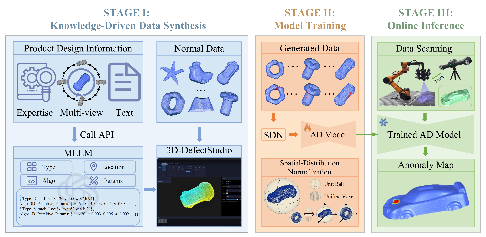
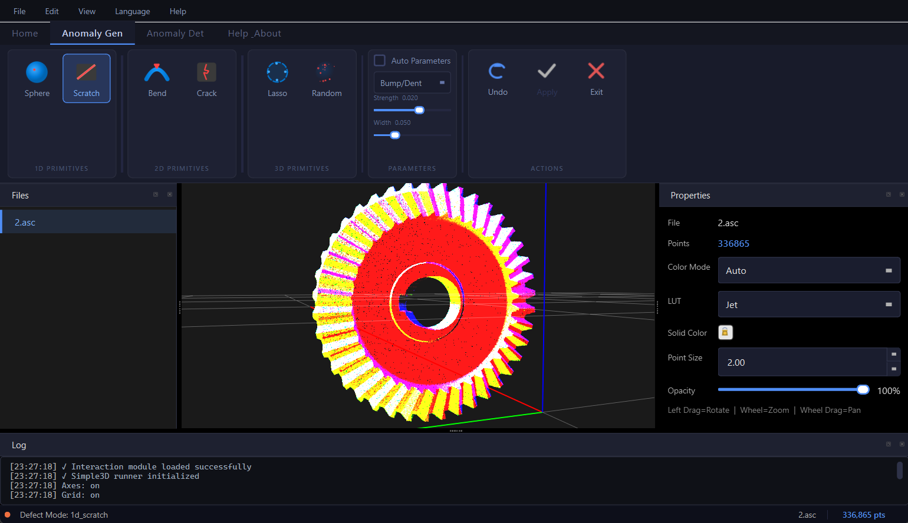
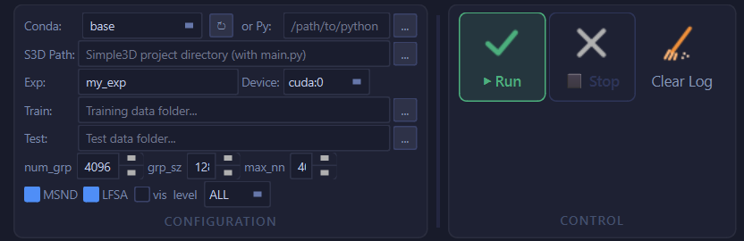

# Synthesis4AD: Synthetic Anomalies are All You Need for 3D Anomaly Detection
🌐 [GitHub Repository](https://github.com/hustCYQ/Synthesis4AD)

> 📚 [**Paper**]() • 🏠 [**Project Homepage**]()  
> by [Yihan Sun*](https://hustsyh.github.io/), [Yuqi Cheng*](https://hustcyq.github.io/), Junjie Zu, Yuxiang Tan, Guoyang Xie, Yucheng Wang, [Yunkang Cao](https://caoyunkang.github.io/), [Weiming Shen](https://scholar.google.com/citations?user=FuSHsx4AAAAJ&hl=en).

## 📑 Quick Navigation
**📖 Discover Synthesis4AD**
* [📊 Introduction](#introduction) 
* [🔍 System Overview](#overview-of-synthesis4ad) 
* [🌟 High-Fidelity Synthesis](#high-fidelity-anomaly-synthesis) 

**🚀 Quick Start & Usage**
* [🛠️ Environment Setup](#getting-started) 
* [▶️ Run the Studio](#run) 

**💻 Developer API (MPAS)**
* [📦 Installation](#installation) & [⚡ Quick Start](#quick-start)
* [🛠️ Function Reference](#function-reference) & [↪️ Return Values](#return-values) 

**📌 Resources**
* [🙏 Acknowledgements](#acknowledgements) | [📖 Citation](#citation) | [📄 License](#license) | [📧 Contact](#contact)

## 📊 Introduction
Industrial 3D anomaly detection is fundamentally constrained by the scarcity and long-tailed distribution of abnormal samples. To address this challenge, we propose **Synthesis4AD**, an end-to-end paradigm that leverages large-scale, high-fidelity synthetic anomalies to learn more discriminative representations.

Built upon the controllable Multi-dimensional Primitive-Guided Anomaly Synthesis (**MPAS**) engine, **Synthesis4AD** interactively injects geometrically realistic defects guided by higher-dimensional primitives and simultaneously generates accurate point-wise anomaly masks. To facilitate a complete end-to-end workflow, this repository also integrates a 3D anomaly detection module, allowing users to easily train and evaluate models using the synthesized data.


## 🔍 Overview of Synthesis4AD

### 1. Multi-dimensional Primitive-Guided Anomaly Synthesis (MPAS)
MPAS generates geometrically realistic defects guided by higher-dimensional support primitives:
* **1D Primitives:** Synthesizes point-like or line-like defects (e.g., Sphere, Scratch).
* **2D Primitives:** Guides deformation along planar patches (e.g., Bent, Crack).
* **3D Primitives:** Utilizes the object convex hull for complex Freeform Defects.


### 2. Synthesis4AD System
To move from an algorithmic design to a practically deployable industrial workflow, we introduce **Synthesis4AD**, a tightly coupled three-stage end-to-end system that unifies anomaly synthesis, detector training, and online inference:

* **Stage I: Knowledge-Driven Data Synthesis.** An MLLM parses product design information into executable instructions, driving **3D-DefectStudio** to automatically inject diverse, realistic anomalies into normal 3D point clouds.
* **Stage II: Model Training.** The anomaly detector is trained using the synthesized data and masks. This stage incorporates Spatial-Distribution Normalization (SDN) and augmentations to ensure robust 3D feature learning across different categories.
* **Stage III: Online Inference.** During deployment, the trained model evaluates newly scanned 3D data, outputting precise point-wise anomaly localization maps and overall object-level anomaly scores.





## 🛠️ Getting Started

🚨 **OS Support:** While 3D-DefectStudio runs on **Windows & Linux**, deploying the **Detection** method within it **requires a Linux system**.

```bash
git clone https://github.com/hustCYQ/Synthesis4AD.git
cd Synthesis4AD
```

This project requires configuring **two separate conda environments**: one for the front-end GUI and another for the backend detection module.

### 🎨 1. Setup the 3D-DefectStudio Environment (Front-end GUI & Synthesis)
This environment is used to run the interactive interface and the MPAS generation engine.

Create and activate the environment:
```bash
conda create -n 3dad-gui python=3.10 -y
conda activate 3dad-gui
```

Install dependencies:
```bash
pip install numpy scipy matplotlib pandas scikit-learn pyyaml tqdm trimesh
pip install open3d==0.19.0 pyside6==6.10.2 pyqtgraph==0.14.0
pip install pyopengl==3.1.10 pyopengl-accelerate==3.1.10
pip install dash==4.0.0 plotly==6.6.0
```
*(Alternatively, you can create this environment directly using the provided YAML file: `conda env create -f envs/environment-3dad-gui.yml`)*

### ⚙️ 2. [Optional] Setup the Simple3D Environment (Detection)

> **💡 Optional but Recommended:** To facilitate a closed-loop workflow, this software seamlessly integrates **Simple3D**—currently the state-of-the-art unsupervised 3D anomaly detection baseline. Setting up this independent environment allows you to rapidly conduct experimental validation and out-of-the-box evaluations on diverse datasets.

Create and activate the environment:
```bash
conda create --name Simple3D_env python=3.8 -y  
conda activate Simple3D_env  
```


```bash
conda install pytorch==1.12.1 torchvision==0.13.1 torchaudio==0.12.1 cudatoolkit=11.3 -c pytorch
pip install tifffile open3d-cpu
```


```bash
pip install --upgrade https://github.com/unlimblue/KNN_CUDA/releases/download/0.2/KNN_CUDA-0.2-py3-none-any.whl

# Compile Pointnet2_PyTorch
git clone https://github.com/erikwijmans/Pointnet2_PyTorch.git
cd Pointnet2_PyTorch
pip install -r requirements.txt
pip install -e .
```


> **Note:** The 3D-DefectStudio GUI serves as the unified front-end for visualization and interaction. While it supports this end-to-end process, **Simple3D** acts as an independent backend module for the detection functionality, and **their environments are configured separately**.

---

## 🚀 Run
Start the **3D-DefectStudio** interface to interactively load normal point clouds, generate anomalous samples, and evaluate:

```bash
conda activate 3dad-gui
python main.py
```
### 1.Interactive Anomaly Generation
Navigate to the **Anomaly Gen** tab to load your point cloud and apply multi-dimensional primitives (e.g., Sphere, Scratch, Bend, Crack). You can interactively adjust parameters like strength and width to synthesize high-fidelity defects in real-time.




### 2.Anomaly Detection
Switch to the **Anomaly Det** tab to configure the Simple3D backend. Specify your conda environment, dataset paths, and algorithm parameters (such as `num_grp`, `grp_sz`, `MSND`, and `LFSA`). Click **Run** to seamlessly execute the detection and visualize the anomaly maps.


**Step 1: Environment & Paths**
* **Conda:** Select `Simple3D_env` from the dropdown to ensure the correct Python environment is used.
* **S3D Path:** Choose the root directory of the Simple3D algorithm.

**Step 2: Data Inputs**
* **Train:** Browse and select the folder containing your **training data**.
* **Test:** Browse and select the folder containing your **test data**.

**Step 3: Experiment & Parameters**
* **Exp (Output):** Enter an experiment name (e.g., `my_exp`).
* **Algorithm Settings:** Adjust optional Simple3D parameters below (such as `num_grp`, `grp_sz`, `MSND`, `LFSA`) based on your specific task needs.




---


## 💻 MPAS API Reference (Python Library)

For developers and researchers looking to integrate anomaly generation into existing machine learning pipelines or automate large-scale dataset synthesis, the MPAS Core Library can be installed as a standalone Python package. This allows you to bypass the GUI and programmatically access all core generation engines with fine-grained parameter control.

### Installation

Navigate to the directory containing `pyproject.toml` and install in editable mode:

```bash
cd path/to/MPAS
pip install -e .
```

### Quick Start

```python
import numpy as np
import mpas

# Load point cloud
points = mpas.load_data_as_pointcloud("your_model.stl")

# Method 1: Call individual functions
result = mpas.sphere(points, radius_ratio=0.03, convex=True)
result = mpas.scratch(points, width_ratio=0.01)
result = mpas.bend(points, rotate_angle=25)
result = mpas.crack(points, gap_width=0.01)
result = mpas.freedom(points, ellipse_a_ratio=0.05)

# Method 2: Unified interface
result = mpas.generate(points, 'sphere', radius_ratio=0.03)

# Get results
anomaly_points = result['anomaly_points']  # Deformed point cloud
mask_points = result['mask_points']        # Anomaly region points
gt = result['gt']                          # GT labels

# Save results
mpas.save_pointcloud(anomaly_points, "output_points.txt")
mpas.save_gt(gt, "output_gt.txt")
mpas.save_mask(mask_points, "output_mask.txt")
```

### Function Reference

* **`mpas.sphere`**: Generates spherical point-like anomalies.
    * `radius_ratio`: Sphere radius ratio (default: 0.03)
    * `convex`: True=convex, False=concave (default: True)
    * `stretch_scale`: Deformation strength (default: 0.02)
* **`mpas.scratch`**: Generates line-like scratch anomalies.
    * `width_ratio`: Scratch width ratio (default: 0.01)
    * `convex`: True=convex protrusion, False=concave groove (default: True)
    * `stretch_scale`: Deformation strength/depth (default: 0.005)
* **`mpas.bend`**: Generates 2D bending anomalies.
    * `rotate_angle`: Bend angle in degrees (default: 25)
* **`mpas.crack`**: Generates 2D structural crack/break anomalies.
    * `gap_width`: Crack gap width (default: 0.01)
    * `depth_ratio`: Depth ratio (default: 0.6)
* **`mpas.freedom`**: Generates complex, freeform 3D anomalies guided by convex hulls.
    * `ellipse_a_ratio`, `ellipse_b_ratio`, `ellipse_c_ratio`: Controls the base bounding region sizes (default: 0.1)
    * `convex`: True=convex, False=concave (default: True)
    * `stretch_mode`: `'noise'` (Gaussian random) or `'surface_fit'` (organic spiral deformation)
    * `noise_strength`: Gaussian noise strength, used if mode is 'noise' (default: 0.2)
    * `surface_scale`: Surface deformation scale 


### Return Values

All functions return a dictionary with:
- `anomaly_points`: Deformed point cloud (N, 3)
- `mask_points`: Anomaly region points (M, 3)
- `gt`: GT labels (N, 1), 1=anomaly


## 🌟 High-Fidelity Anomaly Synthesis

Rather than just applying simple noise or regularized heuristic perturbations, **MPAS** can faithfully reproduce realistic defect morphologies at the geometric level. Furthermore, by enabling compositional synthesis, it produces complex and heterogeneous compound anomalies that combine multiple deformation modes, substantially enriching the anomaly space.


Visualization of anomalies. From top to bottom: real anomalies, synthesized anomalies by MPAS with the same types, and two rows of more diverse compound anomalies synthesized by MPAS. Red insets highlight defect regions for detailed comparison.</em></p>


---

## 🙏 Acknowledgements
Thanks to related 3D anomaly detection and point cloud processing projects for inspiration, including:
* 🌟 **GLFM**
* 🚀 **Simple3D** 

---

## 📖 Citation
If you find our data or code helpful for your research, please consider citing our paper:

```bibtex
@article{sun2026synthesis4ad,
  title={Synthesis4AD: Synthetic Anomalies are All You Need for 3D Anomaly Detection},
  author={Sun, Yihan and Cheng, Yuqi and Zu, Junjie and Tan, Yuxiang and Xie, Guoyang and Wang, Yucheng and Cao, Yunkang and Shen, Weiming},
  journal={Submitted to IEEE Transactions on Systems, Man, and Cybernetics: Systems},
  year={2026}
}
```


```bibtex
@inproceedings{cheng2026towards,
  title={Towards high-resolution 3d anomaly detection: A scalable dataset and real-time framework for subtle industrial defects},
  author={Cheng, Yuqi and Sun, Yihan and Zhang, Hui and Shen, Weiming and Cao, Yunkang},
  booktitle={Proceedings of the AAAI Conference on Artificial Intelligence},
  volume={40},
  number={5},
  pages={3327--3334},
  year={2026}
}
```
```bibtex
@article{cheng2025boosting,
  title={Boosting global-local feature matching via anomaly synthesis for multi-class point cloud anomaly detection},
  author={Cheng, Yuqi and Cao, Yunkang and Wang, Dongfang and Shen, Weiming and Li, Wenlong},
  journal={IEEE Transactions on Automation Science and Engineering},
  year={2025},
  publisher={IEEE}
}
```

## 📄 License

This project is released under the [CC BY-NC 4.0 License](https://creativecommons.org/licenses/by-nc/4.0/). 

You are free to share and adapt the software and MPAS for **non-commercial purposes**, provided you give appropriate **attribution** (see [Citation](#-citation)). 

**Commercial Use:** Any commercial application of this project or its derived works is strictly prohibited without prior written permission. For commercial inquiries, please contact [yihansun@hust.edu.cn](mailto:yihansun@hust.edu.cn) or [yuqicheng@hust.edu.cn](mailto:yuqicheng@hust.edu.cn).

## 📧 Contact
If you have any questions about our work, please do not hesitate to contact:
* [yihansun@hust.edu.cn](mailto:yihansun@hust.edu.cn)
* [yuqicheng@hust.edu.cn](mailto:yuqicheng@hust.edu.cn)

